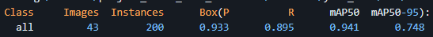

## ABOUT SCENE TEXT RECOGNITION
Scene Text Recognition is an application of image processing algorithms and character recognition to identify text appearing in natural images. This problem has many practical applications, such as:
- Text processing in images: Recognizing text in documents, books, newspapers, signs, etc.
- Information retrieval: Identifying text in images on the web to extract necessary information.
- Automation: Recognizing text in images to automate tasks such as order processing, payments, etc.

Additionally, Scene Text Recognition plays a crucial role in various fields including:
- Optical Character Recognition (OCR): Converting scanned documents or images containing text into editable and searchable formats.
- Augmented Reality (AR): Overlaying digital information or translations onto real-world scenes containing text.
- Document Analysis: Analyzing and categorizing documents based on the text content for indexing or archival purposes.
- Assistive Technologies: Helping visually impaired individuals by converting text from images into audio or braille formats.
- Surveillance and Security: Extracting text from surveillance camera footage for identification or monitoring purposes.

## In this project, we will experiment the task on [ICDAR2003](http://www.iapr-tc11.org/mediawiki/index.php/ICDAR_2003_Robust_Reading_Competitions) dataset. You can download it via this [link](https://drive.google.com/file/d/1x9e2FNDlKc_lBkJvHvWSKKfCSSqNsQfM/view) or you can have it on the main page of the competition
=====

## A Scene Text Recognition program typically consists of two main stages:
<p align="center">
 
</p>
1. Text Detection (Detector): Identifying the location of text in the image. In this project, we use YOLOv8s as the detection model
2. Text Recognition (Recognizer): Recognizing the text at the identified locations. Assuming that YOLOv8s possible to capture full area of text regions, thereso, we only need a light-weighted Recognizer [CRNN](https://arxiv.org/pdf/1507.05717.pdf)

## Getting Started
1. Install `requirements.txt`

2. Detection folder as initial step:
```
%cd detection
preprocessing.py
detection.py
```
3. Recognition is a bit more complicated but you can follow the `recognition.py` for keep track what to do.

If run correctly, the results should output something like this:
- Detection:
<p align="center">
 
</p>
- Recognition
<p align="center">
 
</p>
